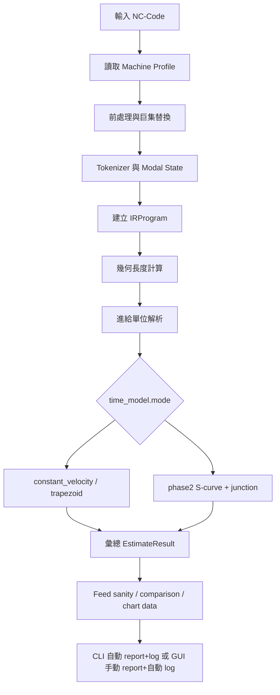

# NC-Time-Twin 專案介紹報告

## 1. 專案概述

NC-Time-Twin 是一個針對 NC-Code / G-code 的加工時間估測與診斷工具。系統會將 NC 程式轉換成可分析的 IR 中介資料結構，依據機台 profile、進給模式、座標系統、刀具路徑幾何、輔助事件與控制器時間模型估算加工總時間，並輸出可追溯的報表與 log。

第二階段優化已加入三軸虛擬控制器模型。除了第一階段的 constant velocity / trapezoid 估測外，Phase 2 可使用軸向最大速度、加速度、jerk、junction tolerance 與 S-curve profile 估算動態加工時間，並輸出 junction、bottleneck 與速度曲線資料。

本專案提供兩種主要使用方式：

- CLI：適合批次估測、CI 檢查、優化前後 NC 比較、自動報表、benchmark 產生與 profile 校正。
- GUI：適合人工選檔、快速估測、檢視中文摘要、block 明細、警告、圖表，並手動決定是否輸出 Report。

## 2. 主要功能

### 2.1 NC-Code 解析

系統可讀取 `.nc`、`.tap`、`.gcode`、`.txt` 等文字型 NC 程式，並執行：

- 移除空白列、`%`、程式號 `Oxxxx`。
- 移除小括號註解與分號後註解。
- 移除行號 `Nxxxx`。
- 將指令正規化為大寫。
- 支援簡單巨集變數指定與替換，例如 `#101=930.5`、`F#101`。
- 對未支援的複雜巨集流程產生警告。
- 將每一行轉換成 token，再根據 modal state 建立 IR block。

### 2.2 支援的指令

支援或辨識的 G-code：

- `G00/G01/G02/G03/G04`
- `G17/G18/G19`
- `G20/G21`
- `G28/G30`
- `G40/G43/G49/G54`
- `G80/G81/G82/G83`
- `G90/G91`
- `G93/G94/G95`

支援的 M-code：

- `M01`
- `M03/M04/M05`
- `M06`
- `M08/M09`
- `M30`

### 2.3 幾何與固定循環

系統會對 motion block 計算起點、終點與長度：

- 線段長度使用三維歐氏距離。
- IJK 圓弧支援 `G17/G18/G19`，並支援平面外位移形成的螺旋長度。
- R 圓弧以弦長與半徑近似，並在報表中保留警告。
- `G81/G82/G83` 會展開為快速移動、切削移動、dwell 與回退等可估測 blocks。

### 2.4 時間模型

系統支援三種時間模型：

- `constant_velocity`：以路徑長度除以有效進給估算。
- `trapezoid`：以 `default_cut_acc_mm_s2` 加入簡化加減速估算。
- `phase2`：第二階段模型，使用三軸速度/加速度/jerk、junction slowdown 與 S-curve profile。

Phase 2 會輸出：

- `phase2_segment_count`
- `phase2_junction_count`
- `phase2_bottleneck_count`
- `phase2_dynamic_sample_count`
- 每個 block 的 entry / exit / peak velocity、速度上限、加速度上限、jerk 上限、profile type、slowdown ratio、bottleneck reason
- 圖表用的 velocity-time samples

### 2.5 進給單位與安全檢查

系統支援：

- `G94`：每分鐘進給。
- `G95`：每轉進給，依賴主軸轉速 `S`。
- `G93`：inverse time feed。

Machine profile 的 `feed_unit` 可為：

- `mm_per_min`
- `m_per_min`
- `inverse_time`
- `auto`

Feed sanity 會檢查低有效進給、G21/G94 低原始 F 值、中低 F 值、極端高 F 值與混合尺度疑慮，並給出 summary、issues 與正規化建議。

### 2.6 優化前後比較

CLI、API 與 GUI 估測頁都支援 candidate NC 與 source NC 比較：

- 比對 block 數量。
- 比對 block 類型、幾何長度、起點、終點。
- 計算總時間差、切削時間差、退化比例。
- 產生各進給區間時間差。
- 找出時間退化最明顯 blocks。
- CLI 可透過 `--fail-on-regression` 回傳 exit code 1；GUI 則顯示中文警示，不阻擋結果檢視。

### 2.7 報表與 GUI 輸出策略

支援輸出：

- JSON：完整結構化資料。
- CSV：block 明細。
- Excel `.xlsx`：summary、blocks、diagnostics 與圖表資料。
- HTML：瀏覽器可讀報表。

CLI 的 `estimate` 仍維持自動輸出 Excel report 與 log，適合批次與 CI。

GUI 的 Estimate 只會自動產生 log，不會自動輸出 Report。使用者可在 Project 頁選擇 `json/csv/xlsx/html` 與輸出資料夾，按「輸出報表」後才寫入檔案。

### 2.8 第二階段工具

第二階段新增兩個機台校正輔助工具：

- `generate-benchmark`：依 Phase 2 profile 產生涵蓋不同 feed、短線段、圓弧、快速移動與輔助事件的 benchmark NC。
- `calibrate-profile`：讀取實測 CSV，以 grid search 調整 acc、jerk、junction tolerance、rapid、event scale，輸出校正後 Phase 2 profile。

GUI 的 Tools 頁已整合：

- Feed 正規化。
- Benchmark NC 產生。
- Phase 2 profile 校正。

## 3. 使用技術與模組

- Python 3.11 以上。
- `pydantic`：machine profile schema 與驗證。
- `PyYAML`：讀取 YAML profile。
- `pandas`、`openpyxl`：報表資料表與 Excel。
- `matplotlib`：GUI 與報表圖表。
- `PySide6`：桌面 GUI。
- `pytest`：自動化測試。

核心模組：

- `api.py`：估測 API 與比較 API。
- `cli.py`：CLI 子命令。
- `gui/main_window.py`：PySide6 GUI。
- `core/parser`：前處理、tokenizer、modal state、macro、NC parser。
- `core/ir`：IR blocks 與 IRProgram。
- `core/geometry`：線段與圓弧幾何。
- `core/simulation/time_estimator.py`：第一階段時間估測與模型分派。
- `core/simulation/phase2.py`：第二階段三軸動態模型。
- `core/machine`：profile schema、benchmark 產生、calibration。
- `core/report`：結果模型、報表 exporter、log 與手動輸出路徑。
- `core/feed_sanity.py`、`core/feed_normalizer.py`：進給診斷與正規化。

## 4. 估測流程

## 5. 專案目前限制

- 複雜巨集流程尚未完整執行，只提供警告。
- R 圓弧仍為近似估算。
- Phase 2 MVP 支援 `kinematic_type: 3_axis`，尚未支援五軸、刀長補正與刀徑補正幾何改變。
- Phase 2 已加入 junction 與 S-curve，但仍不是完整控制器 lookahead / servo 模擬。
- `G40/G43/G49/G54` 目前視為 modal/no-op，不改變幾何或補正。

## 6. 適用情境

- NC 程式加工時間初估。
- 優化器輸出前後的時間比較與退化檢查。
- 找出慢速 block、異常 feed 或混合 feed scale。
- 產生加工時間報表與 log。
- 用 benchmark 與實測資料校正 Phase 2 profile。
- 作為後續控制器 lookahead、機台動態模型與數位雙生模擬的基礎。
