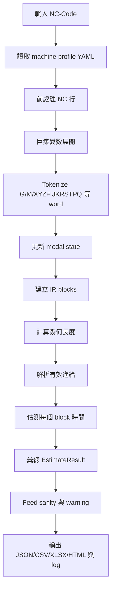

# NC-Time-Twin 專案介紹報告

## 1. 專案概述

NC-Time-Twin 是一個針對 NC-Code / G-code 的加工時間估測工具。專案目標是把加工程式轉換成可分析的中介資料結構，依照機台設定、進給模式、座標系統、刀具路徑幾何與輔助事件時間，估算整支程式的加工總時間，並輸出可檢查的明細報表。

本專案目前提供兩種主要使用方式：

- CLI：適合批次估測、CI 檢查、優化前後 NC 程式比較、報表自動產生。
- GUI：適合人工選檔、快速估測、檢視摘要、block 明細、警告與圖表。

專案也包含 feed sanity 檢查與進給值正規化工具，用於處理常見的 NC 優化器輸出問題，例如同一份程式中混用 mm/min 與 m/min 尺度，造成加工時間估測失真。

## 2. 主要功能

### 2.1 NC-Code 解析

系統可讀取 `.nc`、`.tap`、`.gcode`、`.txt` 等文字型 NC 程式，進行下列處理：

- 移除空白列、`%`、程式號 `Oxxxx`。
- 移除小括號註解與分號後註解。
- 移除行號 `Nxxxx`。
- 將指令正規化為大寫。
- 支援簡單巨集變數指定與替換，例如 `#101=930.5`、`F#101`。
- 對未支援的複雜巨集流程，例如 `IF`、`WHILE`、`GOTO`、`DO`、`END`，產生警告。
- 將每一行轉換成 token，再根據 modal state 建立 IR block。

### 2.2 支援的 G-code

目前程式碼支援或辨識下列 G-code：

- `G00`：快速移動。
- `G01`：線性切削移動。
- `G02` / `G03`：順時針 / 逆時針圓弧移動。
- `G04`：暫停 dwell。
- `G5` / `G5.1` 類平滑事件：記錄事件，不加時間。
- `G17` / `G18` / `G19`：圓弧平面選擇。
- `G20` / `G21`：英制 / 公制單位。
- `G28` / `G30`：參考點返回。
- `G40` / `G43` / `G49` / `G54`：目前視為支援的 modal/no-op，不產生未支援警告。
- `G80`：取消鑽孔循環。
- `G81`：鑽孔循環。
- `G82`：含 dwell 的鑽孔循環。
- `G83`：啄鑽循環。
- `G90` / `G91`：絕對 / 增量座標。
- `G93`：inverse time feed。
- `G94`：每分鐘進給。
- `G95`：每轉進給。

### 2.3 支援的 M-code

目前程式碼支援下列 M-code：

- `M01`：optional stop。
- `M03` / `M04`：主軸啟動。
- `M05`：主軸停止。
- `M06`：換刀。
- `M08`：切削液開啟。
- `M09`：切削液關閉。
- `M30`：程式結束。

### 2.4 幾何與刀具路徑計算

系統會對可定位的 motion block 計算起點、終點與長度：

- 線段長度：使用三維歐氏距離。
- 圓弧長度：
  - 優先使用 IJK 計算圓心與角度。
  - 支援 `G17`、`G18`、`G19` 三個圓弧平面。
  - 若使用 `R` 指定半徑，會以弦長與半徑近似計算，並產生「R arc length is approximate」警告。
  - 若圓弧有平面外位移，會以螺旋路徑方式把圓弧長度與平面外位移合成。
- 鑽孔循環會展開為快速移動、切削移動、dwell 與回退移動等多個 IR blocks。

### 2.5 加工時間估測

系統會依據 block 類型計算時間：

- 快速移動時間。
- 線性切削時間。
- 圓弧切削時間。
- dwell 時間。
- 換刀時間。
- 主軸啟停時間。
- 切削液開關時間。
- optional stop 時間。
- 參考點返回時間。
- 平滑事件計數。

估測結果會彙整為總時間、切削時間、快速時間、輔助時間、總路徑長、事件次數、警告、feed 統計、進給區間直方圖與最慢 blocks。

### 2.6 進給單位解析與安全檢查

系統支援下列進給模式：

- `G94`：每分鐘進給。
- `G95`：每轉進給，依賴主軸轉速 `S`。
- `G93`：inverse time feed。

機台設定中的 `feed_unit` 可為：

- `mm_per_min`：G21/G94 的 F 值視為 mm/min。
- `m_per_min`：G21/G94 的 F 值視為 m/min，估測時乘以 1000 轉為 mm/min。
- `inverse_time`：整體採 inverse time 進給語意。
- `auto`：自動判斷 G21/G94 中低於 100 的 F 值是否可能代表 m/min。

Feed sanity 會檢查：

- G21/G94 中低於 100 的原始 F 值。
- 100 到 999 的中等低原始 F 值。
- 高於 `max_cut_feed_mm_min * 5` 的極端 F 值。
- 低於 1000 mm/min 的有效進給。
- 是否存在混合尺度疑慮。

### 2.7 優化前後比較

CLI 與 API 支援將候選 NC 程式與來源 NC 程式比較：

- 比對 block 數量。
- 比對 block 類型、幾何長度、起點、終點。
- 計算總時間差、切削時間差、退化比例。
- 產生各進給區間的時間差。
- 找出時間退化最明顯的 blocks。
- 可透過 `--fail-on-regression` 讓 CLI 在退化時回傳 exit code 1。

### 2.8 報表輸出

系統支援下列輸出格式：

- JSON：完整結構化資料，適合後續系統串接。
- CSV：block 明細表。
- Excel `.xlsx`：包含 summary、blocks、diagnostics，並可加入圖表 sheet。
- HTML：可用瀏覽器檢視的摘要與明細報表。

每次 CLI 或 GUI 估測後，系統也會自動輸出：

- `output/Report_<NC檔名>_<yyyyMMdd_HHmm>.xlsx`
- `logs/<NC檔名>_<yyyyMMdd_HHmm>.log`

## 3. 使用技術

### 3.1 語言與執行環境

- Python 3.11 以上。
- 採用 `src/` layout 的 Python package。
- 使用 `setuptools` 與 `pyproject.toml` 管理 package metadata。

### 3.2 主要套件

- `pydantic`：定義與驗證 machine profile 設定。
- `PyYAML`：讀取 YAML 格式的機台設定檔。
- `numpy`：保留於科學計算依賴。
- `pandas`：建立 Excel 報表資料表。
- `matplotlib`：產生刀具路徑與 block time 圖表。
- `openpyxl`：寫入 `.xlsx` 並嵌入圖表。
- `PySide6`：桌面 GUI。
- `pytest`：自動化測試。

### 3.3 模組分層

核心套件位於 `src/nc_time_twin`：

- `api.py`：對外 API，串接解析、幾何、估測、摘要與診斷。
- `cli.py`：命令列介面。
- `gui/main_window.py`：PySide6 GUI。
- `core/parser`：NC 前處理、tokenizer、modal state、巨集與 NC parser。
- `core/ir`：中介表示 IR blocks 與 IRProgram。
- `core/geometry`：線段與圓弧幾何計算。
- `core/machine`：machine profile schema 與 YAML 載入。
- `core/simulation`：時間估測與進給單位解析。
- `core/report`：估測結果資料模型、自動輸出與多格式 exporter。
- `core/feed_sanity.py`：進給合理性診斷。
- `core/feed_normalizer.py`：進給值正規化工具。

## 4. 加工時間估測流程

整體流程如下：



### 4.1 讀取機台設定

系統以 `profiles/default_3axis.yaml` 作為預設機台設定。內容包含：

- 機台名稱與控制器名稱。
- 單位與進給單位。
- X/Y/Z 軸快速速度、最大速度、加速度、jerk。
- 快速進給、最大切削進給、預設切削進給。
- 圓弧容差。
- dwell 單位。
- 換刀、主軸、切削液、optional stop 等輔助事件時間。
- 啄鑽 clearance。
- 時間模型。
- 參考點返回模型。

這些設定會由 Pydantic schema 驗證，例如軸設定必須包含 X/Y/Z，時間與速度多數必須大於或等於 0。

### 4.2 NC 前處理

讀入 NC 檔案後，系統逐行處理：

1. 去除換行符號。
2. 去除空白列與 `%`。
3. 去除 `(comment)` 與 `; comment`。
4. 去除行號 `N100`。
5. 轉成大寫。
6. 排除 `O1234` 程式號。
7. 產生保留原始行號的 clean line。

保留原始行號的目的是讓報表與警告可以回指到 NC 原始檔案。

### 4.3 Modal state 解析

NC-Code 的多數指令是 modal 的，例如：

- 前一行設定 `G01 F1000` 後，下一行只寫 `X100`，仍代表以 G01 與 F1000 移動。
- `G90` / `G91` 會影響後續座標解讀。
- `G20` / `G21` 會影響尺寸單位。
- `G94` / `G95` / `G93` 會影響 F 值意義。

系統會在解析每一行前保存前一個 state，解析該行後更新目前 state，並用前後 state 決定 block 的起點、終點與屬性。

### 4.4 IR block 建立

每一行 NC-Code 可建立零個、一個或多個 IR blocks。常見 block 類型包含：

- `RapidMoveBlock`
- `LinearMoveBlock`
- `ArcMoveBlock`
- `DwellBlock`
- `ToolChangeBlock`
- `SpindleEventBlock`
- `CoolantEventBlock`
- `OptionalStopBlock`
- `ReferenceReturnBlock`
- `SmoothingEventBlock`
- `ProgramEndBlock`
- `UnknownBlock`

例如同一行包含 `T1 M06` 會產生換刀事件；包含 `S1000 M03` 會產生主軸啟動事件；包含座標字與 active motion 則會產生 movement block。

### 4.5 鑽孔循環展開

`G81`、`G82`、`G83` 會展開成可估測的 movement blocks。

`G81` 基本流程：

1. 快速移動到 XY。
2. 快速移動到 R 平面。
3. 以進給速度切削到 Z 深度。
4. 快速退回 R 平面。

`G82` 在 Z 深度加入 dwell。

`G83` 依 `Q` 啄鑽深度切成多段：

1. 每段切削到下一個 peck 深度。
2. 快速退回 R 平面。
3. 若尚未到最終深度，快速接近下一段起點。
4. 接近距離使用 `cycle.peck_clearance_mm`。

### 4.6 幾何長度計算

線性移動長度：

```text
length = sqrt(dx^2 + dy^2 + dz^2)
```

快速移動與線性切削都使用上述三維長度作為路徑長度。

IJK 圓弧會先根據平面決定投影：

- `G17`：XY 平面，使用 I/J。
- `G18`：XZ 平面，使用 I/K。
- `G19`：YZ 平面，使用 J/K。

圓弧半徑由起點到圓心與終點到圓心平均取得，角度依 `G02` / `G03` 方向計算：

```text
arc_length = radius * delta_theta
```

若有平面外位移，則：

```text
helical_length = sqrt(arc_length^2 + out_of_plane_delta^2)
```

R 圓弧以弦長與半徑近似：

```text
angle = 2 * asin(chord / (2 * radius))
arc_length = radius * angle
```

若 `R < 0`，角度會改用大圓弧。

### 4.7 進給解析

G94 公制每分鐘進給：

```text
feed_mm_min = F
```

若 `feed_unit = m_per_min`，則：

```text
feed_mm_min = F * 1000
```

英制單位會透過 25.4 轉為 mm：

```text
feed_mm_min = F * 25.4
```

G95 每轉進給：

```text
feed_mm_min = F * unit_factor * spindle_speed
```

若缺少主軸轉速 `S`，系統會使用 `default_cut_feed_mm_min` 並產生警告。

G93 inverse time：

```text
time_sec = 60 / F
effective_feed_mm_min = length / time_sec * 60
```

若進給超過 `max_cut_feed_mm_min`，會截斷到上限並記錄 capped 統計。

### 4.8 快速移動時間

快速移動採同步軸時間模型。系統分別計算 X/Y/Z 各軸所需時間，再取最大值：

```text
tx = abs(dx) / (X.rapid_velocity_mm_min / 60)
ty = abs(dy) / (Y.rapid_velocity_mm_min / 60)
tz = abs(dz) / (Z.rapid_velocity_mm_min / 60)
rapid_time_sec = max(tx, ty, tz)
```

這代表多軸同動時，總時間由最慢完成的軸決定。

### 4.9 切削移動時間

切削移動支援兩種時間模型。

`constant_velocity`：

```text
time_sec = length_mm / (feed_mm_min / 60)
```

`trapezoid`：

```text
target_velocity = feed_mm_min / 60
t_acc = target_velocity / max_acc
d_acc = 0.5 * max_acc * t_acc^2
```

若距離足夠完成加速、等速、減速：

```text
time_sec = t_acc + d_const / target_velocity + t_acc
```

若距離不足，使用三角速度曲線：

```text
t_peak = sqrt(distance / max_acc)
time_sec = 2 * t_peak
```

目前 trapezoid 模型使用 `default_cut_acc_mm_s2` 作為最大切削加速度。

### 4.10 輔助事件時間

輔助事件直接從 profile 讀取固定時間：

- `M06`：`event_time.tool_change_sec`
- `M03` / `M04`：`event_time.spindle_start_sec`
- `M05`：`event_time.spindle_stop_sec`
- `M08`：`event_time.coolant_on_sec`
- `M09`：`event_time.coolant_off_sec`
- `M01`：`event_time.optional_stop_sec`
- `G04`：依 `P` 或 `X` 與 dwell 單位換算。

### 4.11 參考點返回時間

`G28` / `G30` 由 `reference_return.mode` 決定：

- `unestimated`：時間為 0，並產生 warning。
- `fixed`：使用 `reference_return.fixed_time_sec`。
- `rapid`：依指定軸與 `reference_return.position` 以快速移動同步軸模型估算。

### 4.12 結果彙總

所有 blocks 完成估測後，系統彙總：

- `total_time_sec`
- `total_time_text`
- `rapid_time_sec`
- `cutting_time_sec`
- `arc_time_sec`
- `dwell_time_sec`
- `tool_change_time_sec`
- `spindle_time_sec`
- `coolant_time_sec`
- `optional_stop_time_sec`
- `reference_return_time_sec`
- `auxiliary_time_sec`
- `total_length_mm`
- 各類事件 count
- feed summary
- feed histogram
- top slow blocks
- feed sanity diagnostics
- comparison diagnostics

## 5. 專案目前限制

- 不完整支援複雜巨集流程；目前只支援簡單 `#變數=數值` 與替換。
- `R` 指定的圓弧為近似估算，完整圓等情境可能不明確。
- 目前時間模型未完整模擬控制器 lookahead、junction blending、jerk limit、轉角減速與實際 servo behavior。
- `G40`、`G43`、`G49`、`G54` 目前視為 no-op，不影響幾何或補正。
- 工件座標系、刀長補正、刀徑補正不會改變目前位置。
- GUI 目前只提供單檔估測、檢視與匯出，不含 compare 與 normalize-feed 操作。

## 6. 適用情境

本專案適合用於：

- NC 程式加工時間初估。
- 優化器輸出前後的時間比較。
- 找出慢速 block 或異常進給設定。
- 檢查 feed scale 是否混用。
- 產生加工時間報表與 log 供工程人員檢視。
- 作為後續加入更完整機台動態模型、控制器 lookahead 與數位雙生模擬的基礎。
