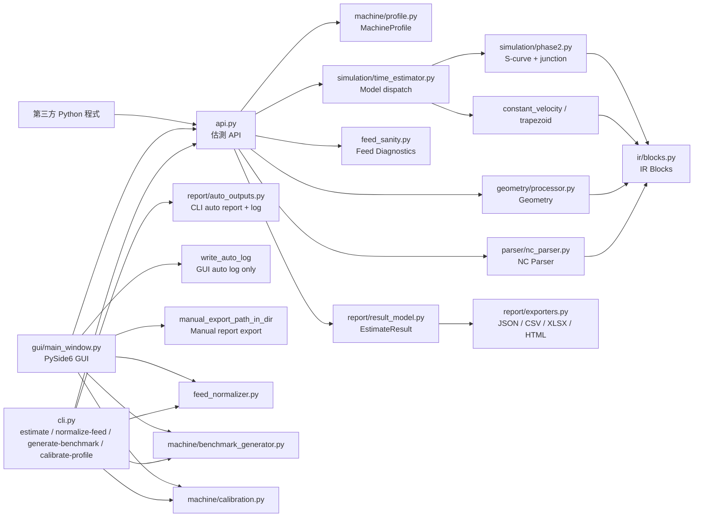
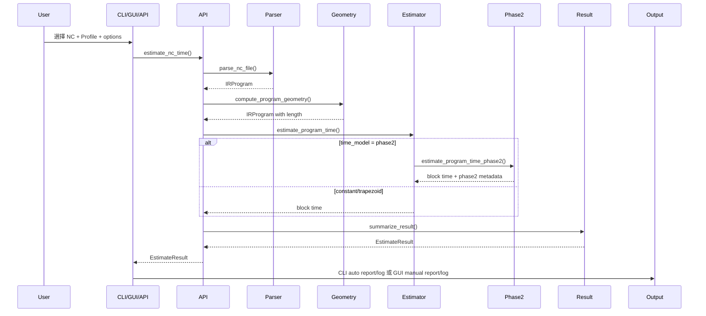

# NC-Time-Twin 系統架構

## 1. 架構目標

NC-Time-Twin 的架構目標是把 NC-Code 從非結構化文字轉換成可估測、可診斷、可輸出的資料模型。第二階段後，系統不只支援幾何與基本時間估測，也支援三軸虛擬控制器動態模型、benchmark 產生與 profile 校正。

系統分成五層：

1. 介面層：CLI、GUI、Python API。
2. 核心解析層：NC 前處理、tokenizer、modal state、IR blocks。
3. 幾何與模擬層：幾何計算、進給解析、constant/trapezoid/phase2 時間模型。
4. 診斷與校正層：feed sanity、comparison、benchmark、calibration。
5. 輸出層：EstimateResult、log、JSON/CSV/Excel/HTML exporter。

## 2. 高階架構圖



## 3. 目錄架構

```text
nc_time_twin_v2/
  docs/
  examples/
  profiles/
    default_3axis.yaml
    default_phase2_3axis.yaml
  src/
    nc_time_twin/
      __init__.py
      __main__.py
      api.py
      cli.py
      core/
        feed_normalizer.py
        feed_sanity.py
        geometry/
        ir/
        machine/
          profile.py
          benchmark_generator.py
          calibration.py
        parser/
        report/
          auto_outputs.py
          exporter_csv.py
          exporter_excel.py
          exporter_html.py
          exporter_json.py
          exporters.py
          result_model.py
        simulation/
          time_estimator.py
          phase2.py
      gui/
        main_window.py
  tests/
  pyproject.toml
  requirements.txt
```

## 4. 主要模組職責

### 4.1 `api.py`

對外估測入口：

- `estimate_nc_time(...)`
- `estimate_nc_time_with_comparison(...)`

流程：

1. 載入與驗證 machine profile。
2. 套用 `feed_unit` / `time_model` 覆寫。
3. 解析 NC 檔並建立 IRProgram。
4. 計算幾何。
5. 依 profile time model 估測時間。
6. 彙總 EstimateResult。
7. 附加 feed sanity。
8. 若為比較估測，附加 comparison result。

### 4.2 `cli.py`

CLI 子命令：

- `estimate`
- `normalize-feed`
- `generate-benchmark`
- `calibrate-profile`

`estimate` 支援 `--feed-unit`、`--time-model`、`--compare-nc`、`--strict-feed`、`--fail-on-regression`、`--fail-on-sanity-error`、`--format`、`--print-summary`。CLI 仍保留自動輸出 Excel report 與 log 的行為，適合批次與 CI。

### 4.3 `gui/main_window.py`

GUI 使用 PySide6，分頁包含：

- `估測`：NC/Profile 選擇、CLI 進階估測設定、中文摘要、完整 Results、Warnings、手動報表輸出。
- `Tools`：Feed 正規化、Benchmark 產生、Profile 校正。
- `Blocks`：逐 block 明細。
- `Charts`：XY toolpath、Block Time、Phase 2 velocity 圖。

GUI Estimate 只自動寫 log，不自動輸出 Report。Report 由使用者選擇格式與輸出資料夾後手動輸出。

### 4.4 `core/machine/profile.py`

以 Pydantic 定義：

- `AxisProfile`
- `ControllerProfile`
- `EventTimeProfile`
- `CycleProfile`
- `TimeModelProfile`
- `ReferenceReturnProfile`
- `MachineProfile`

第二階段新增或使用的重點欄位：

- `kinematic_type`
- `default_cut_jerk_mm_s3`
- `arc_chord_tolerance_mm`
- `controller.same_direction_angle_threshold_deg`
- `controller.reverse_angle_threshold_deg`
- `controller.lookahead_max_iterations`
- `controller.velocity_tolerance_mm_s`
- `controller.phase2_max_samples_per_block`
- `time_model.mode: phase2`

### 4.5 Parser / IR / Geometry

- `parser/preprocess.py`：清理 NC 行並保留原始行號。
- `parser/tokenizer.py`：解析 G/M/XYZFIJKRSTPQ 等 word。
- `parser/modal_state.py`：保存 motion、plane、unit、feed mode、位置、主軸、刀號、cycle 狀態。
- `parser/macro.py`：支援簡單 `#變數=數值` 與替換。
- `parser/nc_parser.py`：建立 IR blocks，包含 fixed cycle 展開。
- `ir/blocks.py`：定義 movement/event/unknown/program blocks，並保留 Phase 2 欄位。
- `ir/program.py`：list-like IRProgram 與 metadata。
- `geometry/line.py`、`geometry/arc.py`、`geometry/processor.py`：計算線段、IJK/R 圓弧與整體幾何。

### 4.6 `core/simulation/time_estimator.py`

負責：

- 程式層級 feed unit 判斷。
- G93/G94/G95 有效進給換算。
- `constant_velocity` / `trapezoid` 模型。
- 當 `time_model.mode == "phase2"` 時分派到 `phase2.py`。
- dwell、tool change、spindle、coolant、optional stop、reference return 事件時間。

### 4.7 `core/simulation/phase2.py`

第二階段三軸動態模型：

- 將連續 motion blocks 組成 motion segments。
- 依軸向最大速度、加速度與 jerk 計算每段 `v_cap`、`a_cap`、`j_cap`。
- 根據相鄰段方向與 junction tolerance 計算 junction velocity limit。
- 以 S-curve transition 估算加速、等速、減速或短距離 degraded profile。
- 產生 dynamic samples、junctions、bottlenecks。
- 將 Phase 2 欄位回填到 block 與 `program.metadata["phase2"]`。

### 4.8 Diagnostics / Tools

- `core/feed_sanity.py`：產生 feed sanity summary、issues、recommendation。
- `core/feed_normalizer.py`：將 G21/G94 F 值正規化為 mm/min。
- `core/machine/benchmark_generator.py`：依 profile 產生 Phase 2 benchmark NC。
- `core/machine/calibration.py`：讀取 `case_id,nc_file,actual_total_time_sec` CSV，校正 Phase 2 profile。

### 4.9 `core/report`

- `result_model.py`：EstimateResult、summary、block table、feed histogram、top slow blocks、comparison、chart data。
- `exporters.py`：依格式分派。
- `exporter_json.py`、`exporter_csv.py`、`exporter_excel.py`、`exporter_html.py`：實際輸出。
- `auto_outputs.py`：
  - `write_auto_outputs()`：CLI 自動 report + log。
  - `write_auto_log()`：GUI Estimate 後只自動寫 log。
  - `manual_export_path()`：預設 `output/` 手動輸出路徑。
  - `manual_export_path_in_dir()`：GUI 指定資料夾手動輸出路徑。

## 5. 資料流



## 6. 核心資料模型

### 6.1 `EstimateResult`

主要欄位：

- `total_time_sec`
- `total_time_text`
- `rapid_time_sec`
- `cutting_time_sec`
- `arc_time_sec`
- `auxiliary_time_sec`
- `total_length_mm`
- `warning_list`
- `block_table`
- `feed_summary`
- `feed_histogram`
- `top_slow_blocks`
- `feed_sanity_summary`
- `feed_sanity_issues`
- `comparison`
- `phase2_summary`
- `phase2_junctions`
- `phase2_bottlenecks`
- `phase2_dynamic_samples`

### 6.2 Phase 2 block 欄位

Movement block 會額外保留：

- `phase2_entry_velocity_mm_s`
- `phase2_exit_velocity_mm_s`
- `phase2_peak_velocity_mm_s`
- `phase2_v_cap_mm_s`
- `phase2_a_cap_mm_s2`
- `phase2_j_cap_mm_s3`
- `phase2_profile_type`
- `phase2_slowdown_ratio`
- `phase2_bottleneck_reason`
- `phase2_segment_count`

## 7. Extension Points

- 新 G-code / M-code：更新 `modal_state.py` 與 `nc_parser.py`。
- 新 block 類型：更新 `ir/blocks.py`、parser、time estimator、report row。
- 更精準幾何：擴充 `core/geometry`。
- 更完整控制器模型：擴充 `simulation/phase2.py`。
- 新校正策略：擴充 `machine/calibration.py`。
- 新報表格式：新增 exporter 並在 `report/exporters.py` 分派。
- GUI 功能：擴充 `gui/main_window.py` 對應工具分頁或主估測頁。

## 8. 測試架構

測試位於 `tests/`：

- `test_parser.py`
- `test_geometry_time.py`
- `test_cycles_reports_cli.py`
- `test_phase2.py`
- `test_gui_source_contract.py`

執行：

```powershell
pytest
```
