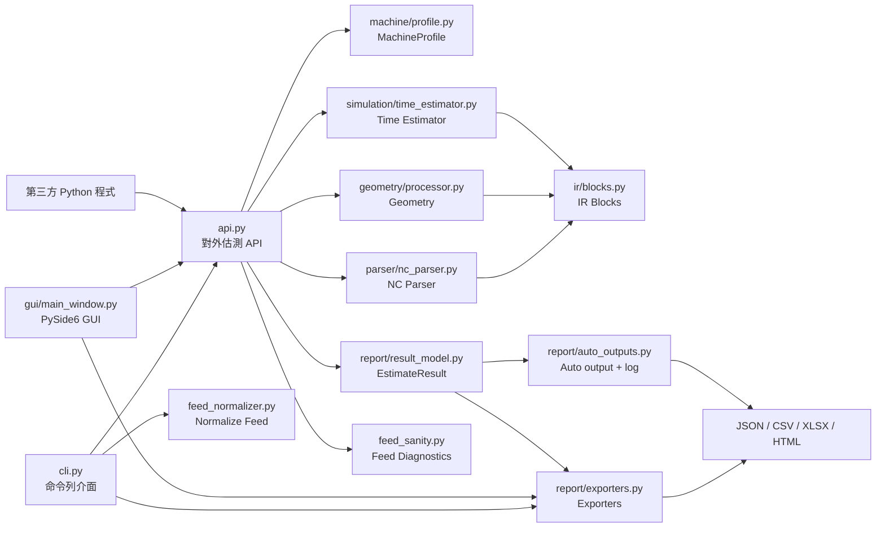
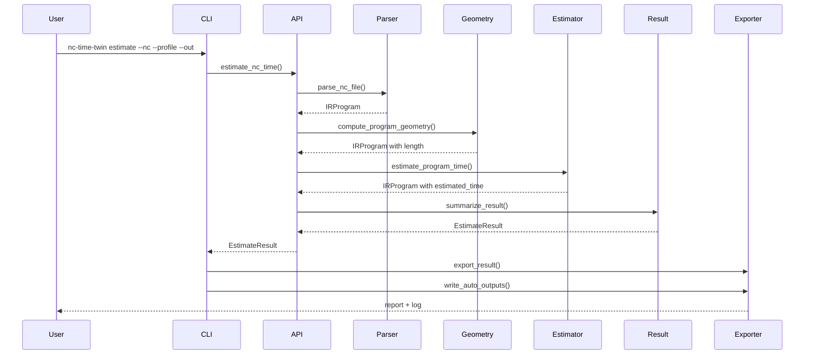

# NC-Time-Twin 系統架構

## 1. 架構目標

NC-Time-Twin 的架構核心是把 NC-Code 從非結構化文字轉換成可估測、可診斷、可輸出的資料模型。系統主要分成四層：

1. 介面層：CLI、GUI、Python API。
2. 核心解析層：NC 前處理、tokenizer、modal state、IR blocks。
3. 模擬估測層：幾何計算、進給解析、時間模型、診斷。
4. 輸出層：結果模型、自動輸出、JSON/CSV/Excel/HTML exporter。

## 2. 高階架構圖



## 3. 目錄架構

```text
nc_time_twin_v1/
  docs/
  examples/
  profiles/
    default_3axis.yaml
  src/
    nc_time_twin/
      __init__.py
      __main__.py
      api.py
      cli.py
      core/
        feed_normalizer.py
        feed_sanity.py
        geometry/
          arc.py
          line.py
          processor.py
        ir/
          blocks.py
          program.py
        machine/
          profile.py
        parser/
          macro.py
          modal_state.py
          nc_parser.py
          preprocess.py
          tokenizer.py
        report/
          auto_outputs.py
          exporter_common.py
          exporter_csv.py
          exporter_excel.py
          exporter_html.py
          exporter_json.py
          exporters.py
          result_model.py
        simulation/
          time_estimator.py
      gui/
        main_window.py
  tests/
  pyproject.toml
  requirements.txt
```

## 4. 主要模組職責

### 4.1 `api.py`

`api.py` 是主要對外入口，提供：

- `estimate_nc_time(...)`
- `estimate_nc_time_with_comparison(...)`

`estimate_nc_time` 的流程：

1. `load_machine_profile`
2. 覆寫 feed unit，若使用者指定。
3. `parse_nc_file`
4. `compute_program_geometry`
5. `estimate_program_time`
6. `link_neighbors`
7. `summarize_result`
8. `analyze_feed_sanity`
9. 回傳 `EstimateResult`

`estimate_nc_time_with_comparison` 會分別估測 source 與 candidate，再以 `compare_estimate_results` 建立比較結果並附加到 candidate result。

### 4.2 `cli.py`

`cli.py` 定義兩個子命令：

- `estimate`
- `normalize-feed`

`estimate` 負責：

- 讀取 CLI 參數。
- 執行單檔估測或比較估測。
- 輸出指定格式報表。
- 自動輸出 Excel 與 log。
- 依 `--fail-on-regression` 或 `--fail-on-sanity-error` 決定 exit code。

`normalize-feed` 負責：

- 依 `--input-feed-unit` 將 G21/G94 F 值正規化為 mm/min。
- 套用 `max_cut_feed_mm_min` 上限。
- 輸出新 NC 檔。

### 4.3 `gui/main_window.py`

GUI 使用 PySide6，提供：

- NC 檔案選擇。
- machine profile 選擇。
- 估測按鈕。
- summary 顯示。
- block table 顯示。
- XY toolpath 與 block time 圖。
- warning 顯示。
- JSON/CSV/XLSX/HTML 匯出。

GUI 目前呼叫 `estimate_nc_time`，未暴露 compare 與 normalize-feed 功能。

### 4.4 `core/machine/profile.py`

此模組以 Pydantic 定義機台設定 schema：

- `AxisProfile`
- `ControllerProfile`
- `EventTimeProfile`
- `CycleProfile`
- `TimeModelProfile`
- `ReferenceReturnProfile`
- `MachineProfile`

也提供 `load_machine_profile(path)` 讀取 YAML 並驗證。

### 4.5 `core/parser/preprocess.py`

負責將原始 NC 行轉為 `CleanLine`：

- 保留原始行號。
- 保留原始 raw 內容。
- 產生清理後 clean 內容。

清理規則包含移除註解、行號、空白列、`%` 與 `Oxxxx`。

### 4.6 `core/parser/tokenizer.py`

將一行 clean NC 轉為 `TokenizedLine`：

- `G`、`M` 可有多個 code。
- 其他 word 以最後一次出現的值為準。
- 支援浮點數與正負號。
- 無法解析的文字會放入 warnings。

### 4.7 `core/parser/modal_state.py`

定義 `ModalState`，保存 NC 程式執行中的 modal 狀態：

- motion。
- plane。
- distance mode。
- unit。
- feed mode。
- feedrate。
- spindle speed。
- current position。
- current tool。
- coolant/spindle/smoothing 狀態。
- canned cycle 與 cycle params。

此模組也提供座標單位轉換與目標座標解析。

### 4.8 `core/parser/macro.py`

支援簡單 macro：

- `#變數=數值`
- `#變數` 替換為既有值。

不支援複雜流程控制，只產生 warning。

### 4.9 `core/parser/nc_parser.py`

此模組負責主解析流程：

1. 讀檔。
2. 前處理。
3. macro assignment 更新。
4. macro reference 展開。
5. tokenize。
6. 更新 modal state。
7. 建立 IR blocks。
8. 回傳 `IRProgram`。

IR 建立邏輯包含：

- M-code event block。
- smoothing event。
- dwell。
- reference return。
- canned cycle expansion。
- motion block。
- unknown block。

### 4.10 `core/ir/blocks.py`

IR block 是估測流程的核心資料結構。共同欄位：

- `line_no`
- `raw`
- `start`
- `end`
- `length`
- `estimated_time`
- `warnings`
- `prev`
- `next`

移動 block 另含 feed、feed mode、spindle speed、unit、effective feed、capped 狀態等欄位。

### 4.11 `core/ir/program.py`

`IRProgram` 是 list-like 容器，附加：

- `metadata`
- `link_neighbors()`

`prev` / `next` 目前主要保留給後續 lookahead 或相鄰 block 分析使用。

### 4.12 `core/geometry`

`line.py`：

- 計算三維線段長度。

`arc.py`：

- 計算 IJK 圓弧長度。
- 計算 R 圓弧近似長度。
- 支援 G17/G18/G19。
- 支援平面外位移。

`processor.py`：

- 對整個 IRProgram 逐 block 計算 geometry。

### 4.13 `core/simulation/time_estimator.py`

負責時間估測：

- 自動解析程式層級 feed unit。
- 計算 rapid time。
- 計算 feed move time。
- 處理 G93/G94/G95。
- 套用 `max_cut_feed_mm_min` 上限。
- 計算 dwell、tool change、spindle、coolant、optional stop、reference return。
- 產生 feed metadata 與 feed warning。

### 4.14 `core/feed_sanity.py`

根據估測後的有效進給與原始 F 值產生診斷：

- summary。
- issues。
- recommendation。

診斷會附加到 `EstimateResult`。

### 4.15 `core/feed_normalizer.py`

將 NC 檔案中的 G21/G94 F 值改寫為明確 mm/min：

- `m_per_min` 輸入乘以 1000。
- `mm_per_min` 輸入保持尺度。
- 超過 `max_cut_feed_mm_min` 時截斷。
- 保留註解。
- 跳過 G20/G93/G95 狀態。

### 4.16 `core/report/result_model.py`

定義 `EstimateResult` 與彙總邏輯：

- summary。
- block table。
- feed histogram。
- top slow blocks。
- comparison result。
- chart data。

也提供 `compare_estimate_results` 進行 source/candidate 比較。

### 4.17 `core/report/exporters.py`

依格式分派：

- `export_json`
- `export_csv`
- `export_excel`
- `export_html`

### 4.18 `core/report/auto_outputs.py`

每次估測後產生自動輸出：

- `output/Report_<stem>_<yyyyMMdd_HHmm>.xlsx`
- `logs/<stem>_<yyyyMMdd_HHmm>.log`

也提供 GUI 手動匯出用的 `manual_export_path`。

## 5. 資料流



## 6. 核心資料模型

### 6.1 `Position`

```text
x: float
y: float
z: float
```

所有座標在解析後都會轉為 mm。

### 6.2 `BaseBlock`

```text
line_no: int
raw: str
start: Position | None
end: Position | None
length: float
estimated_time: float
warnings: list[str]
prev: BaseBlock | None
next: BaseBlock | None
```

### 6.3 移動類 blocks

`RapidMoveBlock`：

- 使用起點與終點計算快速時間。

`LinearMoveBlock`：

- `feedrate`
- `feed_mode`
- `spindle_speed`
- `unit`
- `feed_unit`
- `effective_feed_mm_min`
- `feed_capped`

`ArcMoveBlock`：

- 線性移動欄位。
- `direction`
- `plane`
- `ijk`
- `r`

### 6.4 事件類 blocks

- `DwellBlock`
- `ToolChangeBlock`
- `SpindleEventBlock`
- `CoolantEventBlock`
- `OptionalStopBlock`
- `ReferenceReturnBlock`
- `SmoothingEventBlock`
- `ProgramEndBlock`
- `UnknownBlock`

## 7. 估測結果模型

`EstimateResult` 主要欄位：

- `total_time_sec`
- `total_time_text`
- `rapid_time_sec`
- `cutting_time_sec`
- `arc_time_sec`
- `dwell_time_sec`
- `tool_change_time_sec`
- `spindle_time_sec`
- `coolant_time_sec`
- `optional_stop_time_sec`
- `reference_return_time_sec`
- `auxiliary_time_sec`
- `total_length_mm`
- event counts
- `warning_list`
- `block_table`
- `ir_program`
- `feed_summary`
- `feed_histogram`
- `top_slow_blocks`
- `feed_sanity_summary`
- `feed_sanity_issues`
- `normalized_feed_recommendation`
- `comparison`

## 8. Extension Points

後續若要擴充，可優先考慮下列位置：

- 新 G-code / M-code：更新 `modal_state.py` 與 `nc_parser.py`。
- 新 block 類型：更新 `ir/blocks.py`、parser、time estimator、report row。
- 更精準圓弧或 NURBS：擴充 `geometry/arc.py` 或新增 geometry 模組。
- 更完整時間模型：擴充 `simulation/time_estimator.py` 的 `TimeModelProfile` 與 `compute_feed_move_time_with_model`。
- 控制器 lookahead / junction slowdown：可利用 `IRProgram.link_neighbors()` 提供的 `prev` / `next`。
- 新報表格式：新增 exporter，並在 `report/exporters.py` 分派。
- GUI 功能：擴充 `gui/main_window.py`，例如 compare、normalize-feed 或 profile editor。

## 9. 測試架構

測試位於 `tests/`：

- `test_parser.py`：前處理、tokenizer、macro、modal continuation、座標模式、reference return、smoothing。
- `test_geometry_time.py`：線段、G93/G95、快速移動、IJK/R 圓弧、feed unit、feed cap、優化前後比較。
- `test_cycles_reports_cli.py`：事件時間、G81/G82/G83、報表輸出、CLI compare、strict feed、normalize-feed、自動輸出。

執行：

```powershell
pytest
```
